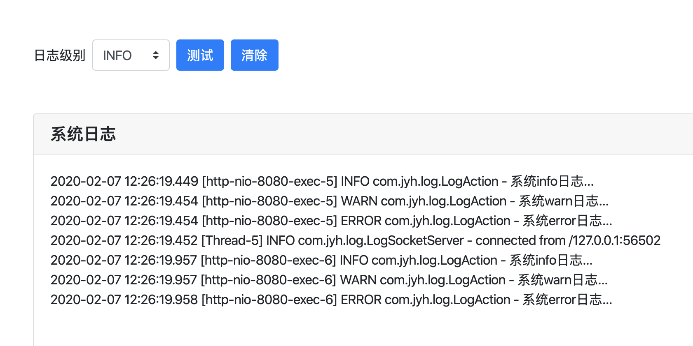

# web-log

  通过自定义logback appender输出日志至websocket，websocket再推送到web显示实时日志数据，避免机房查日志或集中式日志造成的网络耗流
  
## 特性
  
  - 日志等级动态切换
  - 动态开关日志
  - 日志数据实时刷新
  
## 配置

  springboot项目，直接启动，访问地址http://localhost:8080
  
  
